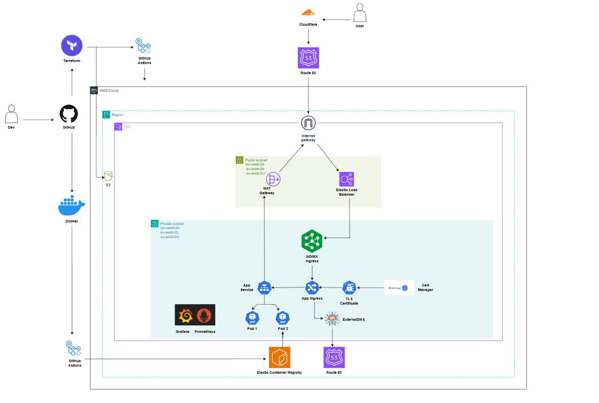
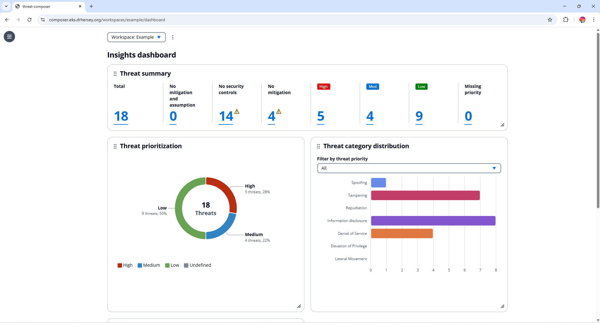
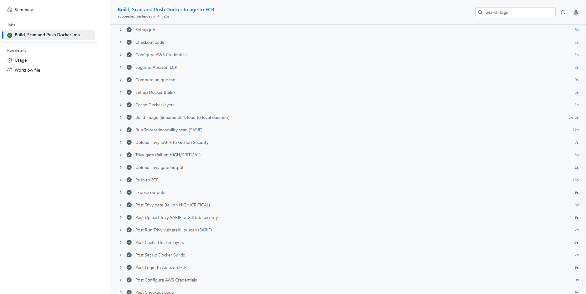
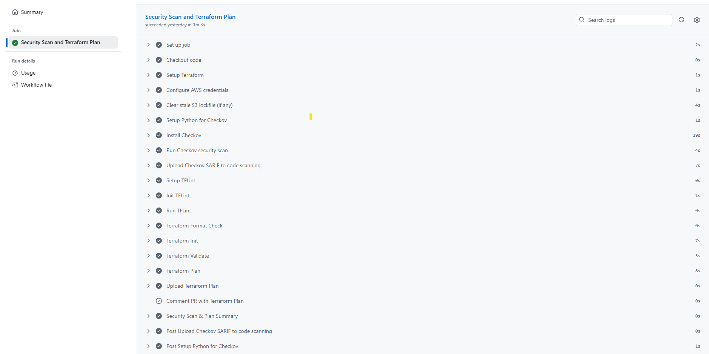
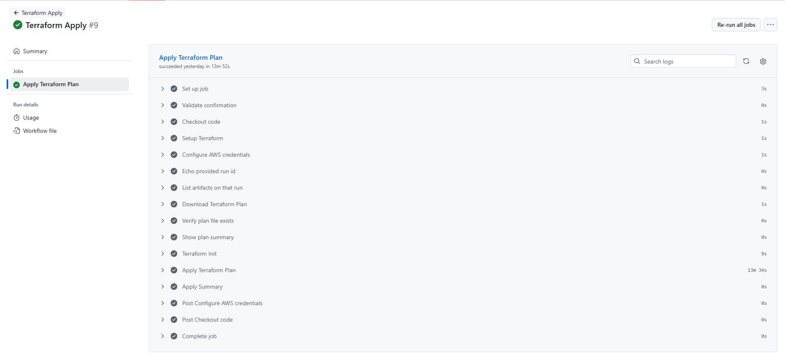
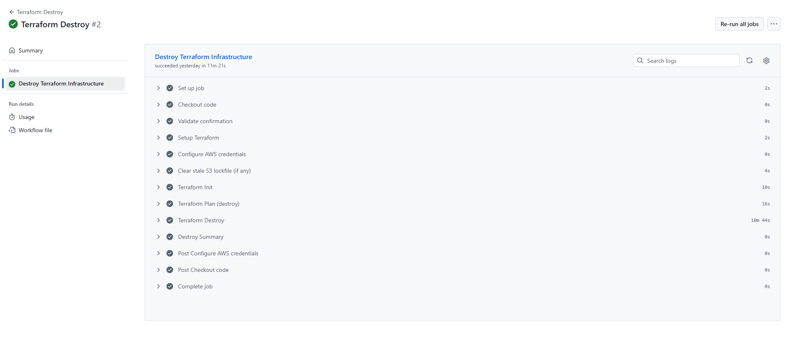
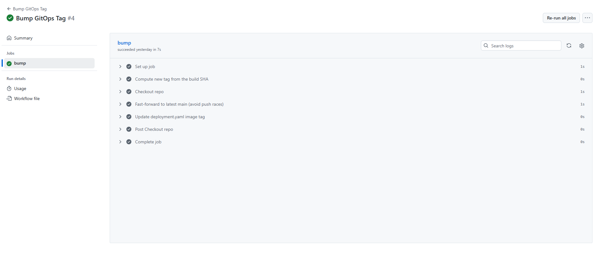

# Kube Composer EKS Deployment

## Overview

This project focuses on the deployment of Kube Composer - an open-source application - onto Amazon Elastic Kubernetes Services (EKS) using Argo CD, Kubernetes manifests, Helm, ExternalDNS, CertManager and kube-prometheus-stack.

It includes:

* Docker based application containerisation.
* Infrastructure provisioning with Terraform (VPC, EKS, IRSA ect).
* CI/CD using GitHub Actions and Argo CD (GitOps)
* Ingress routing using NGINX
* TLS certificate automation using CertManager
* Dynamic DNS updates using ExternalDNS (Route53)
* Monitoring and dashboards using Prometheus and Grafana

## Architectural Diagram




## Local App Setup

To run the app locally:

```bash
yarn install
yarn build
yarn global add serve
serve -s build
```

## Repository Structure

```
kube-composer
├── .github
│   └── workflows
│       ├── bump.gitops-tag.yaml
│       ├── docker-build.yaml
│       ├── terraform-plan.yaml
│       ├── terraform-apply.yaml
│       └── terraform-destroy.yaml
├── README.md
├── app
│   └── Dockerfile
├── gitops
│   ├── app
│   │   ├── app.yaml              # Argo CD Application for kube-composer app
│   │   └── monitoring.yaml       # Argo CD Application for monitoring (Prometheus/Grafana)
│   └── workloads
│       ├── kube-composer-app
│       │   └── base
│       │       ├── deployment.yaml
│       │       ├── ingress.yaml
│       │       └── service.yaml
│       └── kube-prometheus-stack
│           └── Chart.yaml
├── images
├── terraform
│   ├── .gitignore
│   ├── backend.tf
│   ├── main.tf
│   ├── outputs.tf
│   ├── provider.tf
│   ├── terraform.tfvars
│   ├── variables.tf
│   └── modules
│       ├── cert-man
│       ├── eks
│       ├── helm
│       ├── irsa
│       └── vpc

```

## Key Components

### Kubernetes & Argo CD

* **Amazon EKS** - Fully managed Kubernetes control plane
* **Managed Nodes Groups** - Host application pods and cluster services
* **Argo CD (GitOps)** - Watches the GitHub repo and continuously syncs:
    * Application workloads
    * Monitoring stack
    * ExternalDNS & CertManager
* This keeps everything consistent, repeatable and version-controlled

### Networking & Ingress

* **NGINX Ingress Controller** - The main entry point into the cluster
* **Application Load Balancer** - Receives traffic from the internet and sends it to NGINX
* **Ingress Rules** - Decide which domain names go to which services (e.g., `composer.eks.drhersey.org → App`, `grafana.eks.drhersey.org → Grafana` )

### DNS (ExternalDNS)

* **ExternalDNS** automatically creates and updates DNS records in Route53 based on the ingress resources deployed in the cluster
* When an application is exposed through an Ingress, ExternalDNS will:
    * Create te correct DNS record (e.g., `composer.eks.drhersey.org`, `grafana.eks.drhersey.org` )
    * Keep records up to date if IPs or load balancers change
* ExternalDNS uses IRSA (IAM Roles for Services accounts) to securly update Route53 without storing credentials.

### Certificate Management (CertManager) 

* **CertManager** provisions and renews TLS certificates automatically
* Works with a Certificate Authroity (i.e. Let's Encrypt) using DNS-01 challanges through Route53
* Any Ingress requesting TLS (e.g., `composer.eks.drhersey.org`, `grafana.eks.drhersey.org` ) will automatically receive:
    * A valid HTTPS certificate
    * A Kubernetes TLS secret containing the cert and key
* Certificates renew automatically and require no manual maintenance

### Monitoring (Prometheus & Grafana) 

* **kube-prometheus-stack** installs:
    * **Prometheus** for metrics collection
    * **Grafana** for dashboards
* Prometheus automatically collects:
    * Node and pod health data
    * CPU and memeory usage
    * Deployment and cluster state
    * Ingress latency and traffic metrics
* Grafana visualises these metrics with prebuilt dashboards.

## CI/CD & Automation (GitHub Actions + Argo CD)

This project uses a combination of **GitHub Actions** and **Argo CD**:

* **GitHub Actions** handles:
  * Building and pushing the Docker image (`docker-build.yaml`).
  * Planning and applying Terraform to create or update the EKS cluster and networking
    (`terraform-plan.yaml`, `terraform-apply.yaml`, `terraform-destroy.yaml`).
  * Bumping the GitOps tag or manifest version so the cluster knows a new release is available (`bump.gitops-tag.yaml`).

- **Argo CD** handles:
  * Watching the GitOps repository for changes.
  * Applying Kubernetes manifests and Helm charts to the EKS cluster.
  * Continuously reconciling the live cluster with the desired state in Git.

  ## Demo Screenshots
  
  ### Domain Page:
  
  
  
  
  ### Grafana Dashboards:
  
  
  
  
  ### Docker Build:
  
  
  
  
  ### Terraform Plan:
  
  
  
  
  ### Terraform Apply:
  
  
  
  
  ### Terraform Destroy:
  
  

  ### Bumping the GitOps Workflow:
  
  

